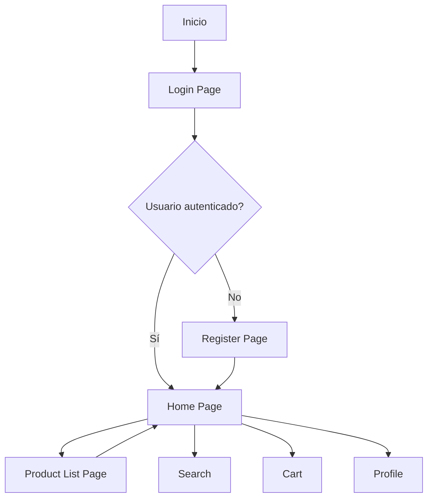
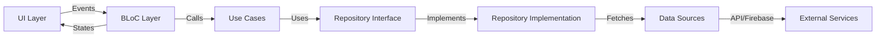
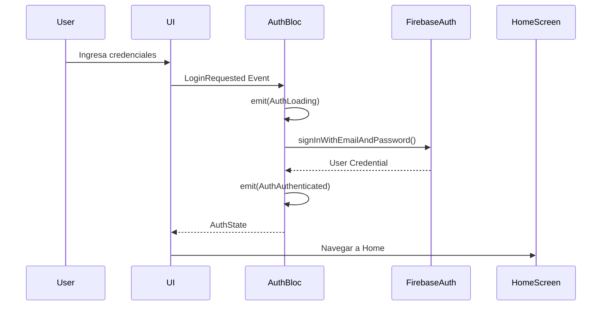
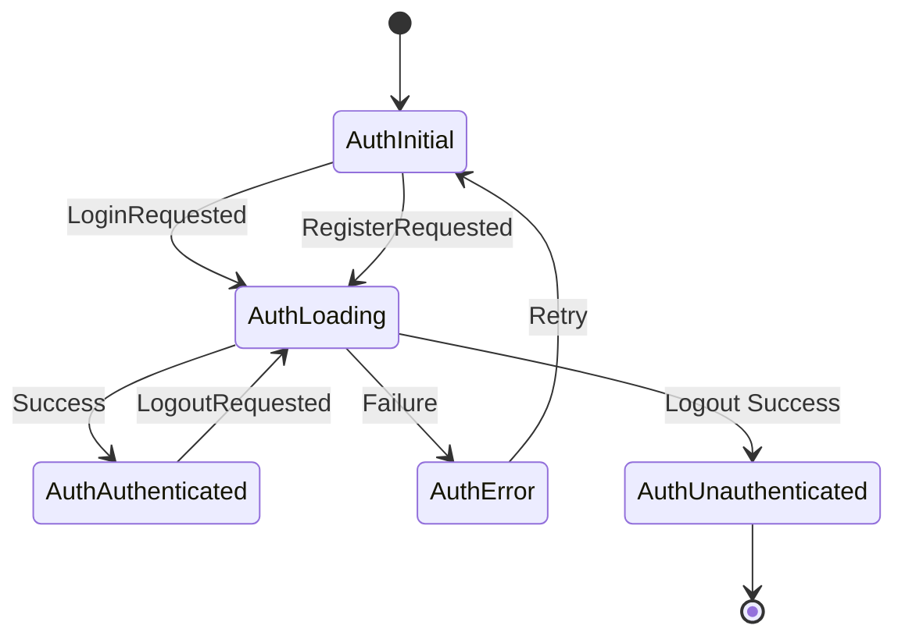
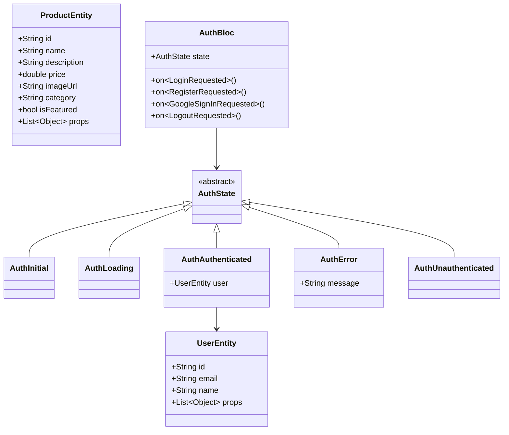
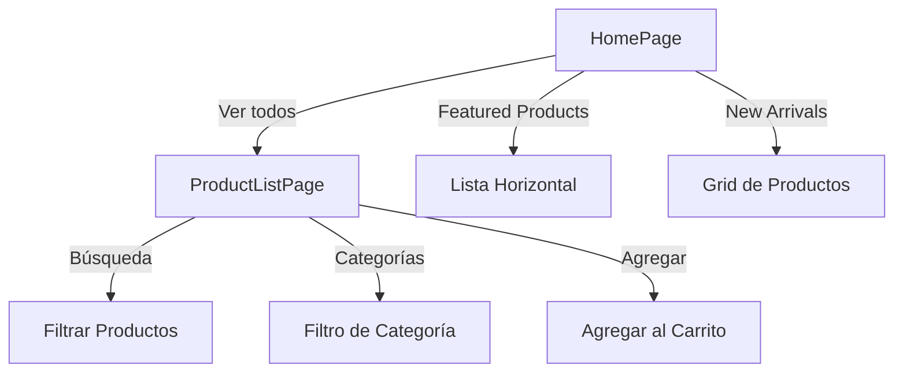

# Kaiho App - Documentación Técnica

## 📋 Descripción General

Kaiho es una aplicación de e-commerce enfocada en productos sostenibles y estilo sustentable. El proyecto está construido en Flutter utilizando la arquitectura BLoC (Business Logic Component) y preparado para integración con Firebase Authentication.

## 🏗️ Arquitectura del Proyecto

### Estructura de Clean Architecture con BLoC

El proyecto sigue los principios de Clean Architecture, organizando el código en capas claramente definidas:

```
lib/
├── core/                      # Funcionalidades compartidas
│   ├── theme/                # Temas y estilos
│   ├── routes/               # Navegación y rutas
│   ├── constants/            # Constantes globales
│   └── utils/                # Utilidades compartidas
│
├── features/                 # Características de la aplicación
│   ├── auth/                # Autenticación
│   │   ├── data/
│   │   │   ├── models/      # Modelos de datos
│   │   │   └── repositories/# Implementación de repositorios
│   │   ├── domain/
│   │   │   ├── entities/    # Entidades de negocio
│   │   │   ├── repositories/# Interfaces de repositorios
│   │   │   └── usecases/    # Casos de uso
│   │   └── presentation/
│   │       ├── bloc/        # BLoC (Estado y Eventos)
│   │       ├── pages/       # Páginas/Pantallas
│   │       └── widgets/     # Widgets específicos
│   │
│   └── products/            # Productos
│       ├── data/
│       ├── domain/
│       └── presentation/
│
└── shared/                  # Widgets compartidos
    └── widgets/
```

## 📊 Diagramas de Arquitectura

### 1. Diagrama de Flujo de Navegación



### 2. Diagrama de Arquitectura BLoC



### 3. Flujo de Autenticación



### 4. Diagrama de Estados de Autenticación



### 5. Modelo de Entidades



### 6. Flujo de Productos



## 🎨 Sistema de Diseño

### Paleta de Colores

| Color | Código Hex | Uso |
|-------|-----------|-----|
| Primary | #00B4D8 | Botones principales, links |
| Secondary | #90E0EF | Acentos secundarios |
| Background | #F8F9FA | Fondo de pantallas |
| Text Primary | #212529 | Texto principal |
| Text Secondary | #6C757D | Texto secundario, hints |
| Error | #DC3545 | Mensajes de error |
| Success | #28A745 | Precios, confirmaciones |

### Tipografía

- **Títulos grandes**: 32px, bold
- **Títulos medianos**: 24px, semibold
- **Cuerpo**: 16px, regular
- **Cuerpo secundario**: 14px, regular

## 🔧 Dependencias Principales

```yaml
dependencies:
  # State Management
  flutter_bloc: ^8.1.6
  equatable: ^2.0.5

  # Firebase
  firebase_core: ^3.8.1
  firebase_auth: ^5.3.3
  google_sign_in: ^6.2.2

  # Navigation
  go_router: ^14.6.2

  # Network & Storage
  http: ^1.2.2
  shared_preferences: ^2.3.3

  # UI
  cached_network_image: ^3.4.1
  shimmer: ^3.0.0
```

## 🚀 Características Implementadas

### ✅ Fase 1 - MVP Actual

- [x] Estructura de carpetas BLoC
- [x] Sistema de navegación con GoRouter
- [x] Pantalla de Login con validación
- [x] Pantalla de Registro con validación
- [x] Home con productos destacados y nuevos
- [x] Listado de productos con búsqueda y filtros
- [x] Sistema de temas (Light/Dark mode preparado)
- [x] AuthBloc con estados básicos
- [x] UI responsive con diseño moderno

### 🔄 Fase 2 - Próximos Pasos

- [ ] Integración con Firebase Authentication
- [ ] Login con Google OAuth
- [ ] Recuperación de contraseña
- [ ] ProductBloc para gestión de productos
- [ ] Carrito de compras con BLoC
- [ ] Detalle de producto
- [ ] Perfil de usuario
- [ ] Persistencia de sesión
- [ ] API REST para productos
- [ ] Implementación de dark mode toggle

### 🎯 Fase 3 - Futuras Mejoras

- [ ] Pasarela de pagos
- [ ] Historial de pedidos
- [ ] Sistema de favoritos
- [ ] Notificaciones push
- [ ] Filtros avanzados de productos
- [ ] Sistema de reviews y ratings
- [ ] Integración con backend propio
- [ ] Tests unitarios y de integración

## 🔐 Integración con Firebase

### Configuración Pendiente

Para completar la integración con Firebase:

1. **Crear proyecto en Firebase Console**
   ```bash
   # Instalar Firebase CLI
   npm install -g firebase-tools

   # Login en Firebase
   firebase login

   # Configurar FlutterFire
   dart pub global activate flutterfire_cli
   flutterfire configure
   ```

2. **Configurar Authentication**
   - Habilitar Email/Password en Firebase Console
   - Habilitar Google Sign-In
   - Configurar dominios autorizados

3. **Actualizar AuthBloc**
   - Reemplazar mock data con llamadas reales a Firebase
   - Implementar manejo de errores específicos
   - Agregar persistencia de sesión

### Ejemplo de Implementación Firebase

```dart
// En auth_bloc.dart - _onLoginRequested
Future<void> _onLoginRequested(
  LoginRequested event,
  Emitter<AuthState> emit,
) async {
  emit(AuthLoading());
  try {
    final credential = await FirebaseAuth.instance.signInWithEmailAndPassword(
      email: event.email,
      password: event.password,
    );

    final user = UserEntity(
      id: credential.user!.uid,
      email: credential.user!.email!,
      name: credential.user!.displayName ?? 'Usuario',
    );

    emit(AuthAuthenticated(user));
  } on FirebaseAuthException catch (e) {
    emit(AuthError(e.message ?? 'Error de autenticación'));
  }
}
```

## 📱 Pantallas Implementadas

### 1. Login Page (`/login`)
- Validación de email y contraseña
- Link a recuperación de contraseña
- Link a registro
- Estados de carga

### 2. Register Page (`/register`)
- Formulario completo con validaciones
- Confirmación de contraseña
- Link a login
- Estados de carga

### 3. Home Page (`/home`)
- Banner hero con imagen destacada
- Sección de productos destacados (scroll horizontal)
- Sección de nuevos productos (grid)
- Bottom navigation bar
- Botón de búsqueda

### 4. Product List Page (`/products`)
- Barra de búsqueda
- Filtros por categoría (chips)
- Grid de productos (2 columnas)
- Contador de carrito en header
- Botón para agregar al carrito

## 🛠️ Comandos Útiles

```bash
# Instalar dependencias
flutter pub get

# Ejecutar la app
flutter run

# Generar código (cuando agregues freezed/json_serializable)
flutter pub run build_runner build --delete-conflicting-outputs

# Limpiar proyecto
flutter clean

# Análisis de código
flutter analyze

# Formatear código
dart format lib/

# Tests
flutter test
```

## 📝 Convenciones de Código

### Naming Conventions

- **Archivos**: `snake_case.dart`
- **Clases**: `PascalCase`
- **Variables/Funciones**: `camelCase`
- **Constantes**: `UPPER_SNAKE_CASE`
- **Privadas**: Prefijo `_`

### Estructura de BLoC

1. **Events**: Acciones que desencadenan cambios de estado
2. **States**: Estados posibles de la feature
3. **Bloc**: Lógica que transforma events en states

### Commits

```
feat: Agregar nueva funcionalidad
fix: Corregir bug
docs: Actualizar documentación
style: Cambios de formato
refactor: Refactorización de código
test: Agregar tests
```

## 🐛 Troubleshooting

### Error: "Null check operator used on null value"
- Verificar que todos los BlocProviders estén configurados en main.dart
- Asegurar que los contextos sean correctos en los BlocConsumer

### Error de navegación con GoRouter
- Verificar que las rutas estén bien definidas en app_router.dart
- Usar `context.go()` para navegación absoluta
- Usar `context.push()` para navegación relativa

### Problemas con Firebase
- Verificar que `google-services.json` (Android) esté en la carpeta correcta
- Verificar que `GoogleService-Info.plist` (iOS) esté configurado
- Ejecutar `flutterfire configure` nuevamente

## 📚 Recursos Adicionales

- [Flutter BLoC Documentation](https://bloclibrary.dev/)
- [Firebase Flutter Setup](https://firebase.flutter.dev/)
- [GoRouter Documentation](https://pub.dev/packages/go_router)
- [Material Design 3](https://m3.material.io/)

## 👥 Contribución

Para contribuir al proyecto:

1. Crear una rama desde `main`
2. Seguir las convenciones de código
3. Escribir tests cuando sea necesario
4. Crear PR con descripción clara

## 📄 Licencia

Este proyecto es privado y confidencial.

---

**Última actualización**: 2025-09-29
**Versión**: 0.1.0
**Estado**: En desarrollo activo